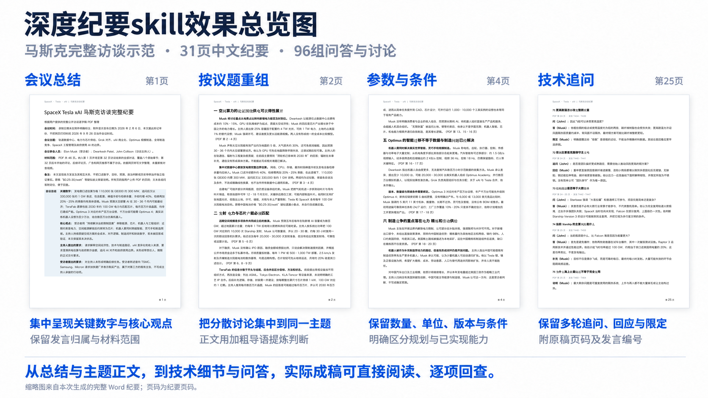
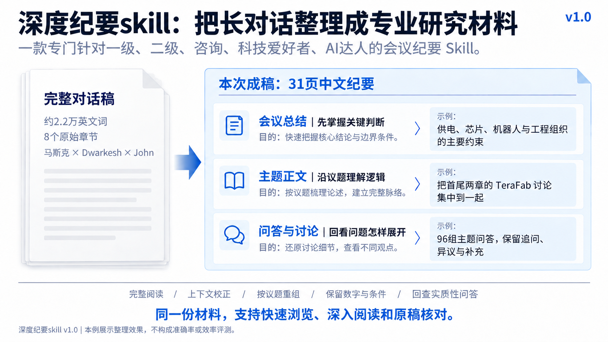
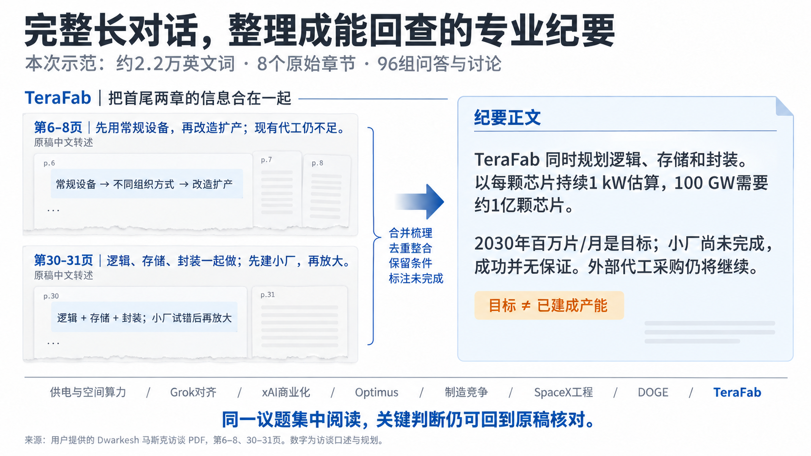
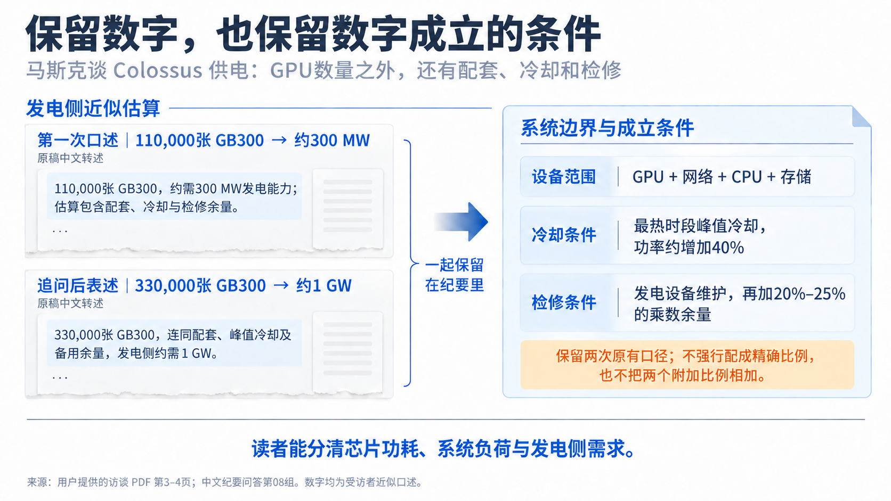
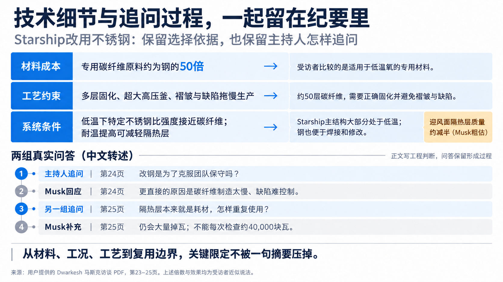
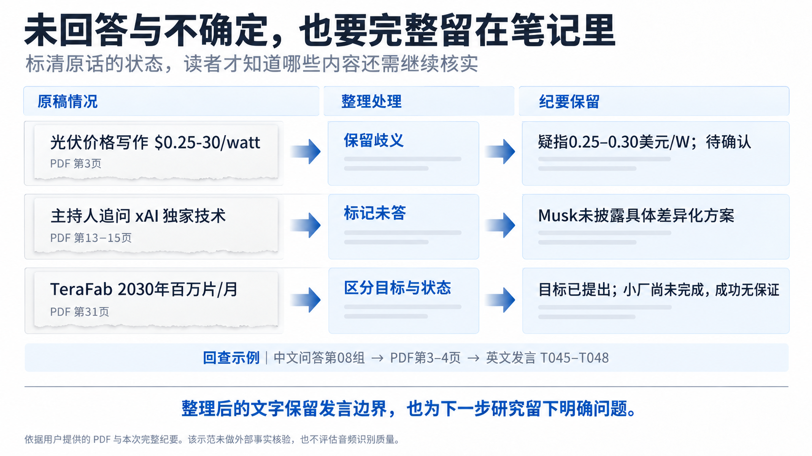

# 深度纪要skill · v1.0

**一款专门针对一级、二级、咨询、科技爱好者、AI达人的会议纪要 Skill。**

把完整长对话整理成可阅读、可回查的专业纪要，保留技术细节、数字条件和实质性问答。



[样例解析](#样例解析) · [阅读完整纪要](examples/musk-full-dialogue/minutes.md) · [下载 Word](examples/musk-full-dialogue/SpaceX_Tesla_xAI_马斯克访谈完整纪要.docx) · [快速开始](#快速开始) · [Skill 原文](skills/meeting-minutes-from-transcript/SKILL.md)

## 一份纪要，三个阅读层次

先看总结掌握关键判断，再按主题理解依据，最后回到问答核对问题如何展开。



**完整阅读 · 上下文校正 · 按议题重组 · 保留数字与条件 · 回查实质性问答**

## 样例解析

### 马斯克完整访谈：从约2.2万英文词，到31页中文纪要

本例使用用户提供的 Dwarkesh Podcast 马斯克完整访谈 PDF。纳入正文从开场至结束的八个章节，覆盖轨道数据中心、Grok、xAI、Optimus、中国制造、SpaceX、DOGE 与 TeraFab。英文对话稿保留 **583 个发言轮次**；中文纪要包含主题正文与 **96 组问答和讨论**，每组可包含多个问题及多轮回应。

| 查看什么 | 文件 |
| --- | --- |
| 直接阅读中文完整纪要 | [Markdown 全文](examples/musk-full-dialogue/minutes.md) |
| 下载排版后的31页纪要 | [Word 完整版](examples/musk-full-dialogue/SpaceX_Tesla_xAI_马斯克访谈完整纪要.docx) |
| 对照输入与说话人 | [完整英文对话稿 TXT](examples/musk-full-dialogue/transcript.txt) |
| 核对范围、来源与复现方法 | [样例解析说明](examples/musk-full-dialogue/README.md) |
| 单独查看或保存六页展示图 | [图片目录](showcase/README.md) |

### 01｜把同一议题的分散信息合在一起

TeraFab 在原稿第6–8页讨论设备、代工与存储限制，第30–31页补充逻辑、存储、封装范围以及小厂状态。纪要将其集中到一个议题中，保留 **2030年目标、小厂尚未完成、成功无保证、继续外部采购** 的区别。



### 02｜数字连同对象、单位和条件一起保留

供电讨论中同时出现 **110,000张GB300约300 MW** 和 **330,000张约1 GW** 两次近似表述。纪要保留网络、CPU、存储、最热时段冷却及检修余量，注明发电侧口径；两次估算分别呈现，附加比例也不直接相加。



### 03｜保留工程取舍，也保留主持人的追问

Starship 改用不锈钢的讨论涉及专用碳纤维成本、约50层材料的固化、褶皱与缺陷、低温比强度及隔热层质量。正文集中呈现这些依据，问答继续保留“是否因为团队保守”“耗材如何实现复用”等追问，并标注原稿页码与发言编号。



### 04｜把歧义、未回答和未完成状态留下来

光伏价格写法存在歧义，就保留原写法和待确认解释；xAI 未披露具体差异化方案，就记录未披露；TeraFab 提出产能目标，就同时写明尚未完成的状态。每组问答都能通过 **PDF页码与T编号** 回查英文对话稿。



本例展示的是实际可核对的整理行为。它没有进行准确率、节省时间或有无 Skill 的对照评测，也没有外部核实受访者的技术与商业判断。输入已是网页逐字稿，因此本例不用于评估音频识别质量。

### 再看一个短样例

想快速逐句对照时，可以阅读[虚构技术交流原稿](examples/technical-review/transcript.txt)与[对应纪要](examples/technical-review/minutes.md)：一个实验线单批95%良率的讨论，展示测试口径、量产待验证状态、备选方案及双方要求怎样被保留。

## 快速开始

### 1. 安装 Skill

下载本仓库并解压，进入仓库根目录。需要安装的是 `skills/meeting-minutes-from-transcript/` 目录。

**macOS / Linux**

```bash
mkdir -p ~/.agents/skills/meeting-minutes-from-transcript
cp -R ./skills/meeting-minutes-from-transcript/. \
  ~/.agents/skills/meeting-minutes-from-transcript/
```

**Windows PowerShell**

```powershell
$skillTarget = Join-Path $env:USERPROFILE '.agents\skills\meeting-minutes-from-transcript'
New-Item -ItemType Directory -Force $skillTarget | Out-Null
Copy-Item -Recurse -Force .\skills\meeting-minutes-from-transcript\* $skillTarget
```

以上命令适用于首次安装；已有同名 Skill 时，先备份自己的修改，再更新同一安装位置，避免重复安装。部分已有环境使用 `~/.codex/skills/`，可沿用当前环境已识别的目录。当前官方文档列出的用户目录为 `~/.agents/skills/`，也支持项目内的 `.agents/skills/`。安装位置与调用方式参见 [OpenAI Skills 文档](https://developers.openai.com/codex/skills/)。

### 2. 提供转写稿并运行

```text
使用 $meeting-minutes-from-transcript 整理我上传的 TXT 转写稿。
输出中文 Word 纪要，保留关键数字、测试条件、技术分歧和完整问答。
无法确认的术语和数据请标注待确认。
```

在支持 `$` 的 Codex 界面中可显式调用上述名称；其他界面可从 Skill 选择器选择，或直接说“使用 meeting-minutes-from-transcript”。任务描述匹配时，Codex 也可以自动选择该 Skill。安装后如未识别，重启 Codex。

## 适合什么场景？

### 企业交流与投资尽调

把管理层访谈、项目路演或企业交流中的业务进展、经营数据、计划与风险按议题归并。企业名称置于标题和文件名开头，便于归档与检索。对“当前能力”“计划产能”“预测收入”等不同口径保留原有状态与限定条件。

### 技术路线与工艺研讨

保留现行路径、备选方案、关键工序、参数和双方理由。出现不同意见时，记录争议所依赖的假设，以及会议提出的验证方法、比较条件与未决问题。

### 研发进展与实验复盘

同时保留实验对象、样品批次、条件、结果和下一步计划。实测值、理论值和目标值分开表述，避免把局部实验结果扩写为已经实现的工程能力。

### 客户、供应商与项目协作

集中提取双方要求提供的样品、文件、数据与测试方案。责任方和截止时间仅在原文明确支持时填写；会议没有形成的承诺不会自动补上。

## 工作流

### 1. 完整读取，确定会议范围

先读完整输入，再核对会议日期、交流主体与核心议题。多段文本能够相互对应时合并；同日发生但内容无关的会议分别整理。

### 2. 核对术语、数字和事项状态

结合重复表述、前后指代、问答关系与量纲检查疑似错词。内部记录关键数据和术语的来源；高置信度纠正统一全文，中低置信度候选显式标注。

### 3. 以真实议题组织正文

把同一议题的分散信息归到一起。重要段落使用加粗导语提炼判断，再展开依据、机制和适用条件；解释性内容保留连贯段落，并列方案或指标按需列表。

### 4. 提炼总结与行动项

会议总结覆盖关键数字、核心观点、对方要求、我方要求。双方角色可确认时改用公司或角色名称；原文没有明确要求时如实写明。形成的决议与后续安排另行呈现。

### 5. 整理并回查完整问答

按主题整理问题、回答、追问、质疑、异议和修正，再逐项核对其去向。正文已出现的结论仍需保留相应问答；会上没有回答的问题注明未形成明确回答。

### 6. 交付并检查文件

默认输出 DOCX，可按要求改为 Markdown 或纯文本。生成 Word 时使用环境中可用的文档工具渲染并逐页检查；环境缺少相应能力时需说明限制。

## 关键质量规则

| 规则 | 具体要求 |
| --- | --- |
| 问答覆盖 | 不预设问题数量或页数上限；有新增实质信息的追问、补充与修正均有去向 |
| 数字保真 | 同时保留对象、单位、条件、比较口径与数据性质 |
| 技术细节 | 保留工序顺序、关键参数、方案取舍与原文提供的验证逻辑 |
| 不确定性 | 保留冲突口径，区分事实、公司说法、判断、目标与待验证事项 |
| 转写纠错 | 用全文证据支持纠正；无法确认的词明确标注 |
| 行动项 | 只写会议支持的事项、责任方与期限 |
| 来源边界 | 默认依据输入材料；用户要求外部核验时，核验结果与会议内容分别说明 |

这些是 Skill 的执行要求。长稿、低质量转写和复杂专业讨论仍需要复核，尤其是影响决策的数字、术语与责任归属。

## 输出物

默认生成一份 Word 纪要：

```text
企业名称_核心议题交流纪要_YYYY-MM-DD.docx
```

明确要求 Markdown 时生成对应 `.md` 文件。日期不确定时使用“日期待确认”。正文一般包含：

```text
企业名称｜核心议题交流纪要
├── 会议时间、主题与参会人员
├── 必要备注
├── 会议总结
│   ├── 关键数字
│   ├── 核心观点
│   ├── 对方要求
│   └── 我方要求
├── 按实际议题组织的正文
├── 会议结论或行动项（原文存在时）
└── 问答与讨论
```

Word 版的基本信息采用简洁的标签—内容排版，会议总结单独使用浅蓝底纹强调。章节随会议内容调整；内部术语台账与问答覆盖台账用于核对，不作为默认交付物。

## 示例指令

### 企业调研纪要

```text
使用 $meeting-minutes-from-transcript，把这份转写稿整理成企业调研纪要。
受众：投资研究团队
输出：DOCX
企业名称放在标题和文件名最前面。
区分已实现的经营数据、管理层预测和需要继续验证的判断，完整保留问答。
```

### 技术路线评审

```text
使用 $meeting-minutes-from-transcript 整理这份技术讨论稿。
重点保留现行工艺与备选方案、关键参数、各方理由、失败条件和验证安排。
多轮追问逐项展开，出现口径修正时说明修正关系。
输出 Markdown。
```

### 多段录音转写合并

```text
使用 $meeting-minutes-from-transcript 处理这几个 TXT。
先根据日期、交流主体和正文确认哪些属于同一场会议，再合并整理。
无法对应的文件分别处理；重复内容合并，冲突数字保留并标注待确认。
输出 Word。
```

### 对照既有纪要补漏

```text
使用 $meeting-minutes-from-transcript，对照完整转写稿检查这份已有纪要。
补齐遗漏的实质性问题、追问、回答、异议和修正，核对重要数字及其条件。
输出修订后的 Word，并在交付说明中简要列出主要补充内容。
```

## 输入与运行条件

- **输入：** TXT 自动转写稿、粗糙逐字稿或粘贴的会议文本。多个文件请尽量说明关系。
- **辅助信息：** 已知的企业名称、会议日期、参会角色、术语表或正式材料，有助于提高核对质量。
- **运行环境：** 能加载本地 Skills 并读取输入文件的 Codex 环境。
- **Word 交付：** 需要文档生成与渲染能力；Skill 本身只包含指令和界面元数据，不附带 DOCX 引擎。

直接输入音频时，应先使用独立转写工具得到文本。精确逐字引用、法律证据记录和正式签署决议需要相应的人工核验流程。

## 目录结构

```text
meeting-minutes-from-transcript/
├── README.md
├── .gitignore
├── showcase/                 # 六页 PNG、总览与展示说明
├── skills/
│   └── meeting-minutes-from-transcript/
│       ├── SKILL.md
│       └── agents/
│           └── openai.yaml
└── examples/
    ├── musk-full-dialogue/
    │   ├── README.md
    │   ├── transcript.txt
    │   ├── minutes.md
    │   ├── SpaceX_Tesla_xAI_马斯克访谈完整纪要.docx
    │   └── visual-notes.md
    └── technical-review/
        ├── transcript.txt
        └── minutes.md
```

`README.md` 展示效果、解析案例并提供安装入口；`showcase/` 存放六页图片；`examples/` 存放完整输入、输出和案例说明；`skills/` 存放可安装的指令。安装时只需复制对应 Skill 目录。

## FAQ

### 可以直接把录音转成文字吗？

该 Skill 从已有转写文本开始处理。录音识别需由独立工具完成，再把文本交给它整理。

### 为什么正文后还有较长的问答？

正文便于按议题阅读结论，问答用于还原问题背景、论据、追问与观点变化。技术评审和尽调中，这些过程信息可能影响对结论的理解。

### 问答真的没有数量上限吗？

指令不设任意数量或页数上限，并要求回查实质性对话的覆盖情况。实际完整性仍受输入长度、转写质量和模型执行情况影响；长会议尤其需要对照原稿复核。

### 会联网补充行业知识吗？

默认只基于输入材料整理。明确要求外部核验时，可另行核验，外部资料不能改写成会议发言。

### 能只输出 Markdown 吗？

可以，在指令中写明“输出 Markdown，不生成 Word”。这也适合没有文档渲染工具的环境。

### 示例是否包含真实客户信息？

`technical-review` 为完全虚构的技术交流；`musk-full-dialogue` 基于用户提供的公开访谈 PDF，包含完整英文对话稿和中文纪要；六页展示图集中保存在 `showcase/`，保留来源信息。仓库不包含真实客户的私密会议资料。提交问题时，请使用脱敏片段或虚构案例。

## 反馈

欢迎通过仓库 Issues 提交问题。建议提供使用场景、可公开的最小输入、实际输出与预期差异，便于复现并改进。

## 许可

本仓库尚未附带开源许可证；再分发与改编权限以作者后续提供的许可证或授权为准。
